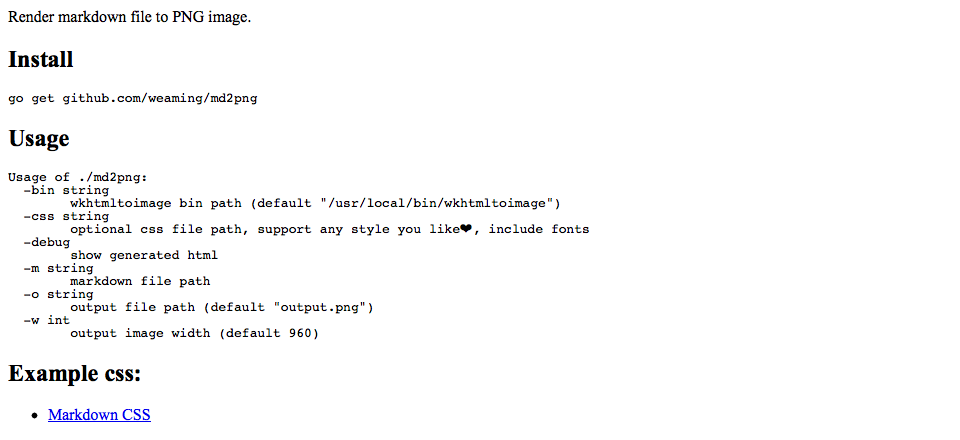
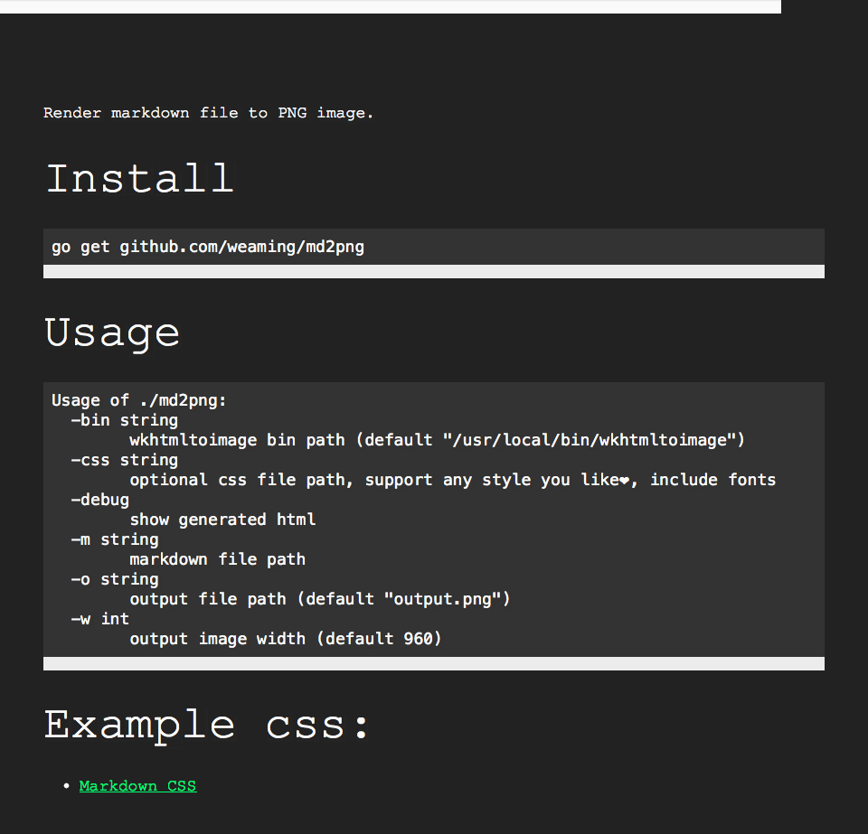

Render markdown file to PNG image.

## Install

    go get github.com/weaming/md2png

## Usage

    Usage of ./md2png:
      -bin string
            wkhtmltoimage bin path (default "/usr/local/bin/wkhtmltoimage")
      -css string
            optional css file path, support any style you like❤️, include fonts
      -debug
            show generated html
      -m string
            markdown file path
      -o string
            output file path (default "output.png")
      -w int
            output image width (default 960)

## Example css:

- [Markdown CSS](http://markdowncss.github.io/)

## ScreenShots

Using retro.css:

